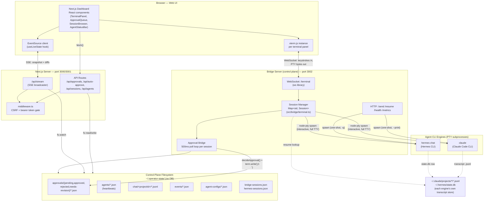
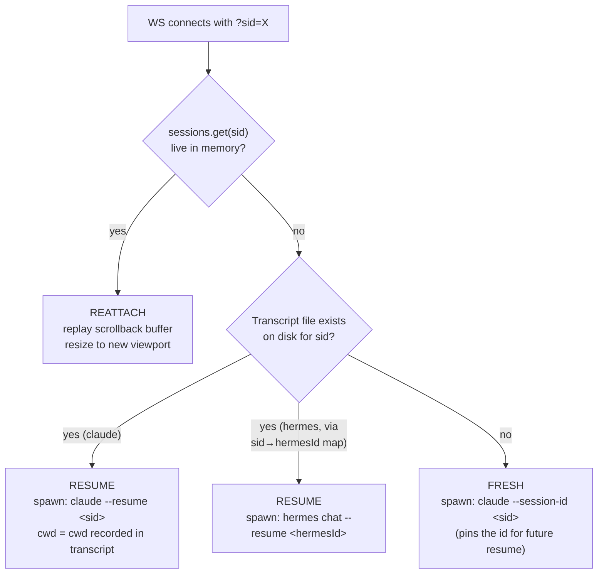
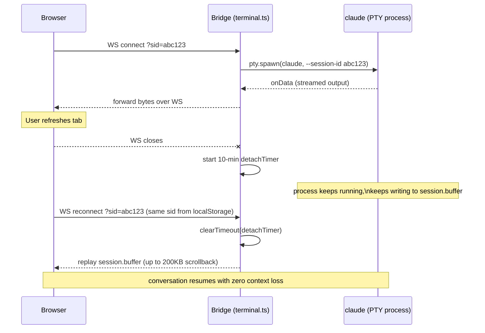
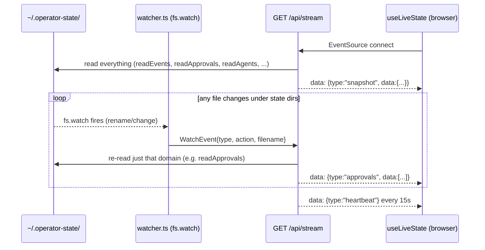
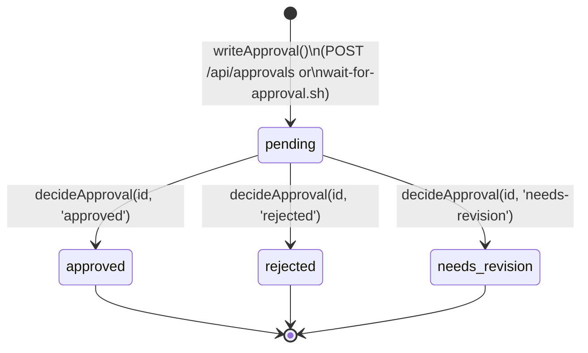

# Operator Cockpit — Architecture

Technical reference for how Operator Cockpit runs multiple long-lived AI agent
CLIs (Claude Code, Hermes) as persistent, browser-attachable terminal
sessions with a centralized human-in-the-loop approval gate.

This document describes the **system as implemented**, with file:line
references into the source so claims here can be verified directly against
code.

---

## 1. System Topology

Operator Cockpit is two Node.js processes plus a flat-file control plane —
deliberately no database, no message broker, no external state store.



**Two independent servers, two independent purposes:**

| Process | Port | Role |
|---|---|---|
| Next.js dashboard | 3000/3001 | Serves the UI, exposes REST/SSE API routes over the flat-file store, no process-spawning capability of its own |
| Bridge server (`src/bridge/server.ts`) | 3002 | The only process allowed to `spawn`/`node-pty.spawn` — owns every agent subprocess, every WebSocket, and all in-memory session state |

This split is intentional and documented in [`docs/adr/001-bridge-manages-sessions.md`](docs/adr/001-bridge-manages-sessions.md):
a browser cannot own a file descriptor or a child process, so whichever
server *can* must be the single source of truth for it. The dashboard is a
thin, stateless client to the bridge's session state.

---

## 2. Process Lifecycle & PTY Management

### 2.1 Spawning

Every interactive agent runs inside a real pseudo-terminal via
[`node-pty`](https://github.com/microsoft/node-pty), not a piped
`child_process` — this is what gives the browser terminal full ANSI
rendering, arrow-key navigation, and Claude Code's own interactive menus
(`src/bridge/terminal.ts:627`):

```ts
term = pty.spawn(file, shellArgs, {
  name: 'xterm-256color',
  cols, rows, cwd,
  env: ptyEnv({ CLAUDE_SESSION_ID: key, CLAUDE_AGENT_NAME: agentLabel }),
});
```

A separate, non-interactive path exists in `src/bridge/server.ts` for
one-shot chat messages (`handleSend`, POST `/send`): it uses plain
`child_process.spawn` with `--print --output-format json`, waits for the
process to exit, and parses the JSON envelope. This is used by the chat
panel, not the terminal panel — two different invocation strategies for the
same CLI binaries, chosen per use case (streaming interactive session vs.
single request/response).

### 2.2 The stable session id (`sid`) is the linchpin

The browser generates a UUID (`sid`) on first terminal open and persists it
in `localStorage`. Every reconnect — tab refresh, network blip, laptop
sleep — reopens the WebSocket with the *same* `sid`. The bridge keys its
entire `Session` map by this id (`src/bridge/terminal.ts:59-75, 87`), so a
reconnect is a lookup, not a new launch.

Connection resolution runs one of three paths, checked in order
(`attachTerminalServer`, `src/bridge/terminal.ts:511-572`):



The important failure mode this avoids: an earlier version had an "ACTIVE"
fallback that assumed a listed-but-untranscribed session could still be
resumed. It couldn't — `claude --resume` on a session with no transcript
file exits 1 with "No conversation found" and kills the panel on arrival.
That fallback was removed; the code now only ever trusts what's verifiably
on disk (comment trail at `src/bridge/terminal.ts:253-267`).

### 2.3 Surviving a browser refresh — the detach grace window

A closed WebSocket does **not** kill the PTY. `attachClient`'s `ws.on('close', ...)`
handler (`src/bridge/terminal.ts:472-488`) starts a **10-minute grace timer**
(`DETACH_GRACE_MS`). If the same `sid` reconnects before it fires, the timer
is cancelled and the buffered output is replayed — the agent's process, its
memory, and its conversation state never noticed the disconnect. Only if
nobody reconnects within the window does the bridge `term.kill()` the
process and evict the session.



### 2.4 stdin/stdout piping

The wire protocol between browser and bridge is JSON-framed messages over
the WebSocket (raw text is also tolerated as a fallback):

- **Browser → Bridge:** `{"type":"input","data":"<keystrokes>"}` → `session.term.write(data)`
- **Browser → Bridge:** `{"type":"resize","cols":n,"rows":n}` → `session.term.resize(cols, rows)`
- **Bridge → Browser:** raw PTY bytes, forwarded verbatim from `term.onData()` to `ws.send()`

The PTY is wired **once**, at spawn time (`term.onData(...)`,
`src/bridge/terminal.ts:684`), and pushes to whatever `session.ws` currently
points at — this is what makes the reattach model work: the browser-side
socket is swappable, the underlying pipe to the process is not.

### 2.5 Graceful termination

Two distinct shutdown paths:

1. **User-initiated close** (`×` button) — `TerminalPanel.tsx` sends
   `{"type":"terminate"}` (todo hook point) and calls `onClose()`
   immediately; `closedByUser.current = true` suppresses any client-side
   reconnect attempt.
2. **Process exit** (`term.onExit`, `src/bridge/terminal.ts:701`) — fires
   when the underlying CLI process itself exits (user typed `/exit`, hit an
   unrecoverable error, etc.). The bridge sends a `[session ended]` banner,
   closes the WS, clears the detach timer, stops the approval-bridge poller
   and any in-flight Hermes id-capture interval, and evicts the session from
   the map.

The client (`TerminalPanel.tsx:340-357`) further distinguishes a **truly
dead** session (matches `/session.*not found|no conversation found/` in
recent output → remove the panel permanently) from a **stalled** connection
(exceeded `MAX_RECONNECT` = 20 attempts with exponential backoff, capped at
15s → stop retrying but keep the panel, since a manual refresh can still
recover it).

---

## 3. Multi-CLI Engine Abstraction

Operator Cockpit supports more than one agent runtime — currently
**Claude Code** and **Hermes** — behind a single `engine: 'claude' | 'hermes'`
field on the agent config (`src/bridge/terminal.ts:39-48`). There is no
formal adapter interface/class hierarchy; the abstraction is a small set of
functions that branch on `engine` at each point where the two CLIs actually
differ, and everything downstream (the PTY, the WebSocket wire protocol, the
browser terminal) is engine-agnostic.

| Concern | `claude` | `hermes` |
|---|---|---|
| Binary | `claude` | `hermes` |
| Session store | `~/.claude/projects/<proj>/<id>.jsonl` | `~/.hermes/state.db` (SQLite) |
| Caller-supplied session id | Yes — `--session-id <sid>` pins it at launch | **No** — `hermes chat` mints its own id |
| Resume flag | `--resume <sid>` | `--resume <hermesId>` |
| Model flag | `--model sonnet\|opus\|haiku` | `-m <model>` |
| Permission mode | `--permission-mode <mode>` (6 modes, see §5) | not exposed |
| Non-interactive one-shot | `--print --output-format json` | `-q "<message>"` |

### 3.1 Why Hermes needs an id-mapping layer and Claude doesn't

This is the one place the abstraction leaks and needs real bridging logic.
`claude` lets the cockpit dictate the session id up front, so the cockpit's
`sid` *is* the claude session id — no mapping needed. `hermes` refuses that;
it always mints its own id on the session's first turn. So a fresh Hermes
launch:

1. Snapshots every existing session id in `state.db` **before** spawning
   (`hermesSessionIds()`, `src/bridge/terminal.ts:157-159`).
2. Spawns `hermes chat` with no id flag.
3. Polls the SQLite store every 3s (`captureHermesSessionId`,
   `src/bridge/terminal.ts:209-226`) for a session started after the spawn
   time that wasn't in the pre-spawn snapshot.
4. On first match, persists `cockpit_sid → hermes_id` to
   `~/.operator-state/hermes-sessions.json` (`recordHermesId`).

Every later resume for that `sid` reads this map first
(`findSessionFile`, `src/bridge/terminal.ts:228-268`) and resumes by the
*hermes* id, not the cockpit `sid` — the two namespaces never collide
because they're never assumed to be equal.

### 3.2 Unified output stream

Because both engines run inside the identical `node-pty` wrapper, the
browser never needs engine-specific rendering logic — ANSI bytes are ANSI
bytes regardless of which CLI produced them. The abstraction boundary is
entirely on the **input/argument-construction side** (what flags to pass,
how to resolve a resumable session) — not on output parsing. This keeps
`TerminalPanel.tsx` and xterm.js completely engine-agnostic; the only
engine-aware client-side code is the trust-prompt auto-acceptance regex
(§5.3), which already tolerates both CLIs' banner text
(`for agents|...|welcome to hermes|...`).

### 3.3 A third, non-CLI backend for headless chat

`src/lib/chat-backends/` adds a third dimension orthogonal to the PTY
engines above: for the lightweight chat-panel feature (not the terminal
panel), messages can route through either:

- **`bridge`** (`chat-backends/bridge.ts`) — proxies to the bridge's
  `POST /send`, which itself spawns the configured CLI engine headlessly, or
- **`anthropic`** (`chat-backends/anthropic.ts`) — calls the Anthropic
  Messages API directly with `@anthropic-ai/sdk`, bypassing any CLI
  entirely and reading/writing the same `chat/<projectId>/*.jsonl` history
  files so the two paths stay interchangeable from the UI's perspective.

Selected via `CHAT_BACKEND` env var (`src/lib/chat-backends/index.ts:9-11`).

---

## 4. State, Session, & Telemetry Sync

### 4.1 The control-plane filesystem is the database

There is no database. `~/.operator-state/` (overridable via
`OPERATOR_STATE_DIR`) is a directory tree where **directory location is
state** — most visibly for approvals, where moving a file between
`pending/` → `approved/` *is* the state transition (§5.1).

```
~/.operator-state/
├── agents/<id>.json                 # heartbeat: status, lastHeartbeat, projectId
├── agent-configs/<id>.json          # engine, model, prompt, workDir, permissionMode
├── projects/<id>.json               # project registration
├── events/<timestamp>-<id>.json     # append-only agent event log
├── chat/<projectId>/<YYYY-MM-DD>.jsonl   # append-only chat transcript (JSON Lines)
├── approvals/
│   ├── pending/<id>.json
│   ├── approved/<id>.json
│   ├── rejected/<id>.json
│   └── needs-revision/<id>.json
├── auto-approve-settings.json       # { [agentId | "global"]: boolean }
├── bridge-sessions.json             # bridge-owned: agentId → claudeSessionId (chat backend)
├── hermes-sessions.json             # cockpit sid → hermes-minted session id
└── session-metadata/<id>.json       # user-assigned session display names
```

All reads/writes go through `src/lib/state.ts` — thin wrappers over
`fs.readdirSync` + `JSON.parse`/`JSON.stringify`, no caching layer. This is
a deliberate simplicity trade-off (documented as a design choice, not an
oversight): any process — the bridge, the dashboard, a shell hook script —
can write a JSON file into this tree and the dashboard will pick it up, with
no client library or schema registration required.

### 4.2 Live sync: filesystem watch → SSE → React state



`src/app/api/stream/route.ts` is a single long-lived `ReadableStream`
response (`Content-Type: text/event-stream`). On connect it sends one full
`snapshot`, then only ever sends **diffs scoped to the domain that
changed** (an approval write triggers `readApprovals()` again, not a full
re-read of everything) — `watcher.ts` maps each watched directory to a
`WatchEvent.type` and the stream handler switches on that type
(`src/app/api/stream/route.ts:57-69`).

The client (`src/hooks/useLiveState.ts`) merges these into React state and
tracks a `usingMockData` flag: it seeds with `mock.ts` sample data so the
dashboard is never a blank screen on first load, and flips to live data the
moment a real snapshot with actual approvals or chat history arrives
(`useLiveState.ts:67-69`).

### 4.3 Telemetry (tokens, uptime, errors) — computed, not persisted

Session metrics are **not** written to the filesystem at all — they live
only in the bridge's in-memory `Session.metrics` object
(`src/bridge/terminal.ts:70-74`) and are recomputed on every PTY data
chunk:

```ts
term.onData((data: string) => {
  session.metrics.totalChars += data.length;
  session.metrics.totalLines += (data.match(/\n/g) || []).length;
  if (/ERROR|error|Exception|.../.test(data)) session.metrics.errorCount += 1;
  ...
});
```

Token count is a heuristic estimate — `Math.ceil(totalChars / 4)`, not a
true tokenizer count from the CLI — deliberately cheap since it only drives
a UI badge, not billing. `getSessionMetrics()` exposes all live sessions'
metrics over `GET /metrics` on the bridge (3002); the dashboard proxies this
via `GET /api/sessions/metrics`, and `SessionMetrics.tsx` polls it every 2
seconds per visible terminal panel. Because this state is in-memory only, it
resets to zero on every bridge restart — a known, accepted trade-off
documented in `CONTEXT.md`'s regression-trap list.

### 4.4 "Past Sessions" — reading the engine's own transcript store directly

The session browser (`GET /api/sessions`,
`src/app/api/sessions/route.ts`) does **not** read cockpit state at all — it
walks `~/.claude/projects/**/*.jsonl` directly (Claude Code's own transcript
directory), extracting a preview (first user message), file size, and
`mtime` per session. This is intentionally decoupled from
`bridge-sessions.json` (which only tracks sessions the *chat backend* has
touched): the session browser surfaces **every** Claude Code conversation
that has ever run on the machine, cockpit-launched or not, because it reads
the same source of truth Claude Code itself uses to resume.

---

## 5. Human-in-the-Loop Safety System

### 5.1 The Approval Queue: directory-as-state-machine

An `ApprovalRequest` is a single JSON file. Its status is not a field an
application layer trusts blindly — it is *encoded by which of four
directories the file physically lives in*, and `decideApproval()`
(`src/lib/state.ts:86-127`) enacts a decision by writing the updated JSON to
the destination directory and `unlink`-ing it from the source:



This gives the system a crash-safe, inspectable audit trail for free — `ls
~/.operator-state/approvals/approved/` *is* the approval log, no query
needed.

### 5.2 Two producers of approval requests

1. **`scripts/wait-for-approval.sh`** — a blocking shell hook an agent
   invokes mid-task (e.g. from a `PreToolUse` hook before a risky command).
   It writes the pending JSON, then polls the filesystem in a loop (default
   timeout 600s, 2s interval) until the file appears in `approved/`,
   `rejected/`, or `needs-revision/`, translating the outcome into a process
   **exit code** (`0` approved / `1` rejected / `2` needs-revision / `3`
   timeout) — so it composes naturally with an agent's own
   exit-code-gated command chaining.
2. **`POST /api/approvals`** — programmatic creation from any process that
   can reach the dashboard's HTTP API.

### 5.3 Two entirely separate trust mechanisms — do not conflate them

The codebase deliberately keeps two different "let the agent proceed"
concepts apart:

| | Approval Queue (risk-scored) | Trust-prompt auto-accept (startup only) |
|---|---|---|
| What it answers | Arbitrary `wait-for-approval.sh` gates an agent author placed in their own workflow | Claude Code's one-time "do you trust this folder?" launch menu |
| Where it lives | `~/.operator-state/approvals/*` (server-side, durable) | `TerminalPanel.tsx` client-side only, ephemeral |
| Mechanism | File move + PTY `write('y\n')` injected by the **bridge** | DOM-scraping xterm's *rendered* rows in the **browser** to find the arrow-menu selection, then sending an `Enter` keystroke |
| Risk model | `riskLevel: low\|medium\|high\|critical`, rationale, affected systems | None — purely a UX convenience to skip a boilerplate first-run prompt |

The trust-prompt code (`TerminalPanel.tsx:132-183`) is worth flagging
because of a real race condition documented in its own comments: sending
`Enter` on an unverified menu selection previously confirmed the *default*
option ("No, exit") and silently killed freshly-launched agents. The fix —
require two consecutive polls confirming "Yes" is the selected row before
sending `Enter` — is a good example of the gap between "looks done" and
"verified correct" in terminal-scraping UIs.

### 5.4 Auto-approve: why it lives in the bridge, not the UI

Auto-approve (a per-agent or global boolean in
`auto-approve-settings.json`, toggled via `POST /api/auto-approve`) is
**enacted exclusively by the bridge**, per
[`docs/adr/002-auto-approve-bridge-level.md`](docs/adr/002-auto-approve-bridge-level.md).
The reasoning: if the *UI* decided approvals, whichever browser tab acted
would need to separately notify the bridge to inject the terminal
keystroke — a network round trip that both races against multiple open tabs
and leaves the terminal hanging on a real interactive prompt in the
meantime. Instead, `setupApprovalBridge()`
(`src/bridge/terminal.ts:331-410`) runs a 500ms poll loop **per live PTY
session**, scoped to that session's `agentId`:

```ts
if (isAutoApproved && approval.status === 'pending' && !wasWatched) {
  const decided = decideApproval(approval.id, 'approved', 'Auto-approved by bridge');
  if (decided) session.term.write('y\n');   // answers the live interactive prompt directly
}
```

Because the bridge both owns the PTY *and* is the one deciding the
approval, there is no cross-process handoff and no race: decide and inject
happen in the same tick, in the same process, against the process that's
actually waiting on stdin.

### 5.5 Global trust routing into the agent process itself

Every spawned PTY carries `COCKPIT_APPROVAL_BRIDGE=1` in its environment
(`ptyEnv()`, `src/bridge/terminal.ts:285-325`). This is the signal a Claude
Code hook (e.g. a `PreToolUse` hook calling `wait-for-approval.sh`) can
check to decide whether it's running *inside* the cockpit and should route
its permission check through the file-based approval gate rather than its
own native CLI confirmation prompt — this is what connects §5.2's producer
script to a live terminal session without the agent needing to know
anything about the dashboard, SSE, or the bridge's WebSocket protocol; it
only needs to write a JSON file and poll for the answer.

`ptyEnv()` also strips inherited `CLAUDE_CODE_CHILD_SESSION` /
`CLAUDE_CODE_SESSION_ID` markers before spawning — a documented bug fix:
without this, launching the bridge from inside an existing Claude Code
shell caused every spawned agent to be treated as a *nested child session*,
which silently disables transcript saving and breaks resume entirely
(comment trail at `src/bridge/terminal.ts:294-316`).

### 5.6 Safe defaults

- Auto-approve is **off** by default and requires an explicit
  `window.confirm()` before enabling in the UI (`ApprovalQueue.tsx:72-78`).
- `bypassPermissions` mode is refused by `POST /api/agents` unless the agent
  has an explicit `workDir` set — otherwise a bypass-mode agent would run
  ungated against the operator's home directory
  (`src/app/api/agents/route.ts:32-42`).
- `middleware.ts` enforces same-origin (CSRF) on every `/api/*` route and
  supports an optional bearer-token gate (`API_TOKEN` /
  `NEXT_PUBLIC_API_TOKEN`) for anything beyond pure localhost use.

---

## Related Documents

- [`docs/adr/001-bridge-manages-sessions.md`](docs/adr/001-bridge-manages-sessions.md) — why the bridge, not the UI, owns terminal state
- [`docs/adr/002-auto-approve-bridge-level.md`](docs/adr/002-auto-approve-bridge-level.md) — why auto-approve is enacted server-side
- [`docs/api/approvals.md`](docs/api/approvals.md), [`docs/api/auto-approve.md`](docs/api/auto-approve.md), [`docs/api/sessions.md`](docs/api/sessions.md) — REST contracts
- [`docs/runbook/incident-response.md`](docs/runbook/incident-response.md) — operational playbook
- [`CONTEXT.md`](CONTEXT.md) — regression traps and dev-loop notes
